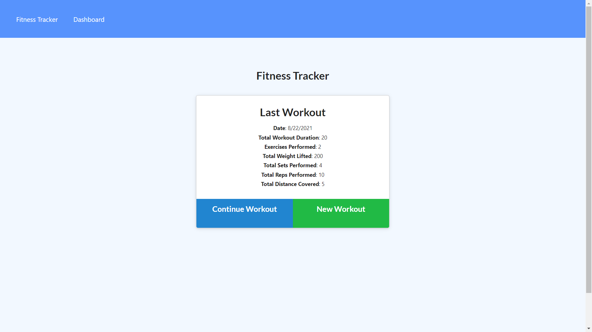
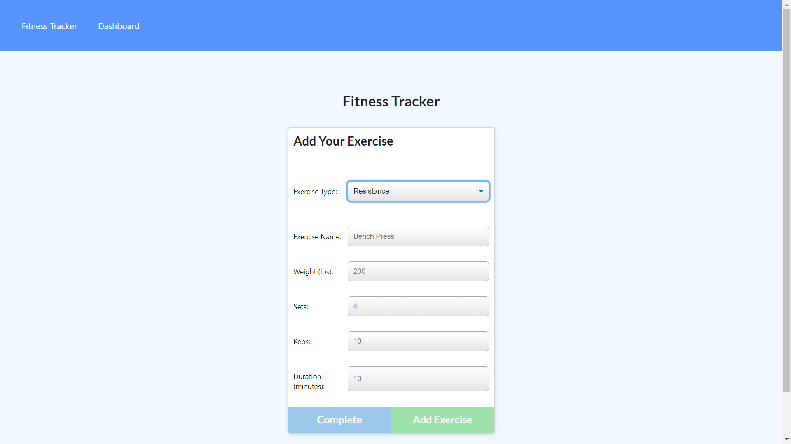
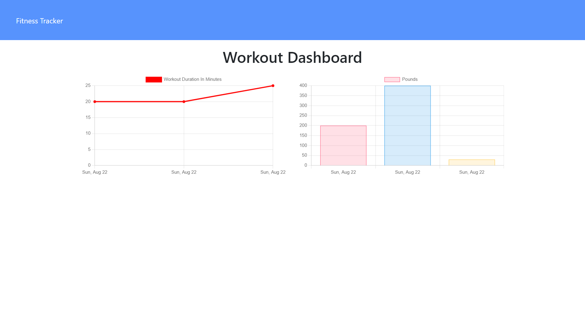

# NoSQL Fitness Tracker

## Description
This application, based in Node.js, makes use of Express, MongoDB, and Mongoose to allow a user to record their workout routines on any given day, compile multiple exercises in a single workout, and view statistics of the duration and weights used in their workouts.  The styling uses Bootstrap and the application is deployed live via Heroku.

## Demo
The live application can be seen [HERE](https://rocky-escarpment-70462.herokuapp.com/)

Main Page:

Adding Exercises:

Statistics page:
